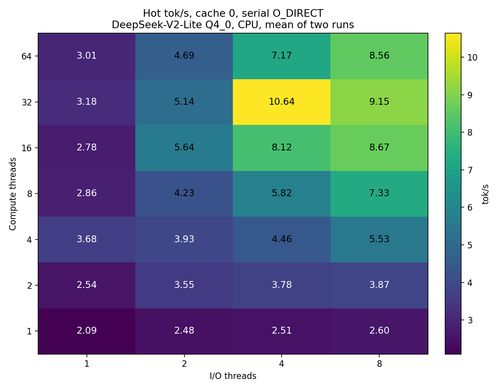

# Compute threads and I/O lanes at a fixed expert cache

Serial O_DIRECT streaming of DeepSeek-V2-Lite pure `Q4_0` on one dual-socket
x86 host. The question is which pool is the heavier slice of hot-decode wall
time once the expert-cache budget is held still: the llama.cpp compute threads
(`-t`) or the engine's I/O lanes (`--io-threads`).

This is not the Jetson mmap / cache-off pair. Those tok/s are traced, on
different CPUs, and live in
[the Jetson record](2026-09-21-jetson-agx-mmap-q4-0.md) and
[the AGX cache sweep](../experiments/moehit.md). Do not set the numbers below
next to those tables.

## Host and build

Two sockets, two NUMA nodes, 32 physical cores per socket, two threads per
core (128 logical CPUs), about 500 GiB of RAM. Threads were not pinned.
Other processes were present; load during the runs was roughly 1 to 4, so a
tok/s split between the two repetitions is reported rather than averaged away.

The binary reported engine 0.23.0, was built CPU-only, and did not link CUDA.
`CUDA_VISIBLE_DEVICES` was empty. Every layer in every log was assigned to
CPU. The CSV header of every cell has `o_direct=1` and `overlap=0`. No
compute trace and no I/O trace.

## Protocol

One fresh process per cell, two repetitions. Before the process,
`POSIX_FADV_DONTNEED` on this file only. The file is 8,851,045,376 bytes.

```text
--moe-stream --dense-weights anon --cache-mb <budget>
-c 256 --ubatch 128
```

No `--overlap`. Greedy. Prompt `The capital of Japan is` (6 tokens),
`n_predict` 32. Two `generate` requests in one process, both
`clear_kv=true`. Turn 0 is cold. Turn 1 is hot. `clear_kv` drops KV only.

Every cell, at all three budgets, produced the same hot text.
Expert read is that turn's `read_mib / 32`. In this serial mode `io_s_tok`
is the blocked read phase. It adds with `compute_s_tok` toward the token
wall. The two repetitions are written `a / b`.

The reference cell inside each matrix is `-t 4 --io-threads 4`. One sweep
moves only `--io-threads` through 1, 2, 4, 8. The other moves only `-t`
through 1, 2, 4, 8, 16, 32, 64. The shared cell is measured once per
repetition and listed in both sweeps.

`--io-threads N` is the lane count in the banner. In serial mode the callback
thread reads lane 0, and the I/O pool owns lanes 1..N-1.

## Why these three budgets

A serial cache sweep on this host, same prompt and same `-t 4 --io-threads 4`,
fixed the three points. Cache 0 rereads the whole routed touch every token.
4 GiB still misses. 8 GiB holds the hot trajectory.

| Cache | Hot expert read | Cumulative hit | Resident |
|---:|---:|---:|---:|
| 0 | 725.77 MiB/token | — | shared slot |
| 4 GiB | 169.23 MiB/token | 70.8% | 4093 MiB |
| 8 GiB | 0 | 88.2% | 6191 MiB |

Dense anonymous weights are 715 MiB. The hot read above does not include
them. Those three read figures were identical across every repetition of the
thread matrices below. Cold decode at 8 GiB still reads 100.03 MiB/token:
that turn is what fills the trajectory. Cold decode at 4 GiB reads 174.17
MiB/token. Cold and hot at cache 0 both read 725.77.

## Cache 0

Hot and cold both read 725.77 MiB/token. Measured 2026-09-24.

I/O lanes, `-t 4`:

| I/O lanes | Hot tok/s | Cold tok/s | Hot read | Hot compute |
|---:|---:|---:|---:|---:|
| 1 | 3.13 / 2.35 | 3.08 / 3.21 | 0.235 / 0.305 s | 0.084 / 0.120 s |
| 2 | 4.38 / 3.35 | 3.86 / 3.44 | 0.143 / 0.181 s | 0.086 / 0.117 s |
| 4 | 5.18 / 6.83 | 4.68 / 5.28 | 0.092 / 0.077 s | 0.102 / 0.070 s |
| 8 | 7.62 / 4.92 | 5.75 / 5.11 | 0.058 / 0.083 s | 0.074 / 0.120 s |

Lanes 1 through 4 shorten the read from about 0.27 s to about 0.08 s and
raise hot tok/s from about 2.7 to about 6. Compute stays in the same band.
Lane 8 has one faster cell (read 0.058 s, 7.62 tok/s) and one cell whose
compute time jumped; that second cell is not an I/O result. Past 4 lanes
there is no stable gain.

Compute threads, `--io-threads 4`:

| Compute threads | Hot tok/s | Cold tok/s | Hot read | Hot compute |
|---:|---:|---:|---:|---:|
| 1 | 2.65 / 2.81 | 3.05 / 2.58 | 0.098 / 0.096 s | 0.279 / 0.259 s |
| 2 | 3.83 / 4.47 | 3.47 / 4.09 | 0.101 / 0.087 s | 0.161 / 0.137 s |
| 4 | 5.18 / 6.83 | 4.68 / 5.28 | 0.092 / 0.077 s | 0.102 / 0.070 s |
| 8 | 5.77 / 6.15 | 5.79 / 5.88 | 0.103 / 0.096 s | 0.070 / 0.067 s |
| 16 | 6.44 / 6.54 | 6.38 / 7.01 | 0.106 / 0.101 s | 0.049 / 0.052 s |
| 32 | 10.47 / 7.46 | 7.31 / 8.23 | 0.070 / 0.092 s | 0.026 / 0.042 s |
| 64 | 7.24 / 6.50 | 6.32 / 5.93 | 0.100 / 0.108 s | 0.039 / 0.046 s |

From 1 to 16 threads, compute falls from about 0.27 s to about 0.05 s and
hot tok/s rises from about 2.7 to 6.5. The read stays near 0.08–0.11 s. By
8 threads compute is already the shorter slice, so 8 to 16 only moves tok/s
from about 6.0 to 6.5. One 32-thread cell reached 10.47 tok/s with both
slices shorter (read 0.070 s, compute 0.026 s). Its pair was 7.46. The
64-thread pair did not beat that faster 32-thread cell.

At cache 0 both slices sit on the critical path. Each knob moves only its
own column. Neither changes the 725.77 MiB/token.

## 4 GiB

Hot read is 169.23 MiB/token on every cell. Cumulative hit 70.8%. Resident
4093 MiB. Measured 2026-09-27.

I/O lanes, `-t 4`. Hot tok/s does not rise with the lane count:

| I/O lanes | Hot tok/s | Cold tok/s | Hot read | Hot compute |
|---:|---:|---:|---:|---:|
| 1 | 5.36 / 3.90 | 3.64 / 4.39 | 0.093 / 0.137 s | 0.087 / 0.112 s |
| 2 | 3.80 / 4.90 | 4.48 / 4.68 | 0.118 / 0.099 s | 0.132 / 0.096 s |
| 4 | 5.40 / 4.61 | 3.35 / 4.53 | 0.074 / 0.074 s | 0.095 / 0.130 s |
| 8 | 3.98 / 7.30 | 4.21 / 7.54 | 0.072 / 0.051 s | 0.159 / 0.073 s |

The read column inches down, and one 8-lane cell reaches 0.051 s and 7.30
tok/s. The paired 8-lane cell is 3.98 tok/s because compute moved to 0.159 s.
Management on this sweep stayed between 0.006 s and 0.021 s. Four lanes
already issue this 169 MiB; more lanes do not produce a stable tok/s gain.

Compute threads, `--io-threads 4`. The read stays near 0.07 s while compute
shrinks:

| Compute threads | Hot tok/s | Cold tok/s | Hot read | Hot compute |
|---:|---:|---:|---:|---:|
| 1 | 1.97 / 2.12 | 2.34 / 2.40 | 0.096 / 0.086 s | 0.399 / 0.374 s |
| 2 | 3.31 / 4.19 | 3.07 / 3.79 | 0.073 / 0.070 s | 0.215 / 0.159 s |
| 4 | 5.40 / 4.61 | 3.35 / 4.53 | 0.074 / 0.074 s | 0.095 / 0.130 s |
| 8 | 5.15 / 5.08 | 5.52 / 6.29 | 0.083 / 0.075 s | 0.091 / 0.105 s |
| 16 | 6.58 / 6.77 | 6.51 / 6.20 | 0.074 / 0.073 s | 0.063 / 0.059 s |
| 32 | 7.10 / 7.24 | 7.25 / 7.27 | 0.074 / 0.074 s | 0.048 / 0.046 s |
| 64 | 7.70 / 7.26 | 7.56 / 7.10 | 0.068 / 0.074 s | 0.044 / 0.046 s |

At 1 thread, compute is about 0.39 s and the read is about 0.09 s. At 4
threads the two slices are close, with compute still a little longer. From
16 threads on, compute is under 0.06 s and the read is the longer piece.
Hot tok/s levels off near 7. Process CPU time divided by the token wall
stays within a few tenths of the requested thread count through 64, so the
extra threads are busy; they are not shortening the token past the read.

## 8 GiB

Hot read is 0 on every cell. Cumulative hit 88.2%. Resident 6191 MiB.
Cold decode still reads 100.03 MiB/token. Measured 2026-09-27.

I/O lanes, `-t 4`. Hot `io_s_tok` is 0.0000 at every lane count. Hot tok/s
moves with the compute residual, not with the lane count:

| I/O lanes | Hot tok/s | Cold tok/s | Hot compute |
|---:|---:|---:|---:|
| 1 | 4.77 / 7.80 | 3.56 / 3.86 | 0.209 / 0.128 s |
| 2 | 7.96 / 12.93 | 4.13 / 6.47 | 0.126 / 0.077 s |
| 4 | 7.82 / 6.46 | 5.54 / 5.46 | 0.128 / 0.155 s |
| 8 | 13.95 / 7.80 | 5.82 / 5.97 | 0.072 / 0.128 s |

Cold tok/s, which still has a read, goes from about 3.7 at 1 lane to about
5.5 at 4 lanes and 5.9 at 8. That is the I/O-lane effect on this budget, and
it is on the cold turn.

Compute threads, `--io-threads 4`:

| Compute threads | Hot tok/s | Cold tok/s | Hot compute |
|---:|---:|---:|---:|
| 1 | 2.94 / 3.04 | 2.51 / 2.49 | 0.341 / 0.329 s |
| 2 | 7.28 / 3.78 | 4.97 / 2.75 | 0.137 / 0.264 s |
| 4 | 7.82 / 6.46 | 5.54 / 5.46 | 0.128 / 0.155 s |
| 8 | 10.10 / 11.77 | 7.94 / 8.33 | 0.099 / 0.085 s |
| 16 | 33.01 / 35.82 | 15.23 / 13.40 | 0.030 / 0.028 s |
| 32 | 29.61 / 24.84 | 10.91 / 11.27 | 0.034 / 0.040 s |
| 64 | 25.04 / 54.00 | 10.28 / 17.06 | 0.040 / 0.018 s |

1 to 16 threads takes the hot turn from about 3 tok/s to 33–36, and both
repetitions agree. 32 threads does not extend that. The 64-thread pair
splits, 25.04 and 54.00. An earlier same-host pass on 2026-09-24, same
budget and the same 4 I/O lanes, also kept a zero hot read and also split
once the thread count was large. That pass added 128 threads: 6.22 / 5.42
tok/s, while process CPU time was still about 127 core-seconds per wall
second. Those 128-thread cells were not re-run on 2026-09-27.

The hot turn at 8 GiB is compute-bound. I/O lanes have no hot read to
shorten.

## What the three budgets say

At `-t 4 --io-threads 4`:

| Cache | Hot read | Hot read time | Hot compute time | Heavier slice |
|---:|---:|---:|---:|---|
| 0 | 725.77 MiB/token | ~0.08 s | ~0.07–0.10 s | both, similar |
| 4 GiB | 169.23 MiB/token | ~0.074 s | ~0.10–0.13 s | compute, slightly |
| 8 GiB | 0 | 0 | ~0.13–0.15 s | compute |

Raising compute threads helps while compute is the longer slice. At cache 0
that help flattens once compute falls below the ~0.08 s read. At 4 GiB it
flattens near 7 tok/s once the 0.07 s read is what remains. At 8 GiB the hot
read is already zero, and compute threads keep raising tok/s through 16.

Raising I/O lanes helps when the read is large and still shortens: cache 0,
from 1 to 4 lanes. It does not give a stable hot-tok/s gain at 4 GiB, and it
cannot move the 8 GiB hot turn.

## Cache 0 joint grid

The one-factor sweeps above move one knob at a time. On 2026-09-27 the same
cache-0 protocol was also run as the full product: compute threads
1, 2, 4, 8, 16, 32, 64 against I/O lanes 1, 2, 4, 8, two repetitions, 56
processes. Every hot read was 725.77 MiB/token, and every cell produced the
same text. The figure is the mean of the two hot tok/s.



| Compute \ I/O | 1 | 2 | 4 | 8 |
|---:|---:|---:|---:|---:|
| 1 | 2.09 | 2.48 | 2.51 | 2.60 |
| 2 | 2.54 | 3.55 | 3.78 | 3.87 |
| 4 | 3.68 | 3.93 | 4.46 | 5.53 |
| 8 | 2.86 | 4.23 | 5.82 | 7.33 |
| 16 | 2.78 | 5.64 | 8.12 | 8.67 |
| 32 | 3.18 | 5.14 | 10.64 | 9.15 |
| 64 | 3.01 | 4.69 | 7.17 | 8.56 |

One I/O lane stays near 2–3.7 tok/s at every compute width. One compute
thread stays near 2.1–2.6 tok/s at every lane count. The fastest mean is
**10.64 tok/s at 32 compute threads and 4 I/O lanes** (the two runs were
10.88 and 10.40). Eight lanes is faster than four at 8 and 16 compute
threads, and slower than four at 32. Sixty-four compute threads is below
the 32-thread row at 4 lanes.

Four cells differed by more than a quarter between repetitions, so the mean
there is a less stable summary: compute 2 / I/O 4 (3.26 / 4.30), compute 4 /
I/O 1 (4.29 / 3.06), compute 8 / I/O 1 (3.26 / 2.46), compute 16 / I/O 2
(4.61 / 6.67). The peak cell is not one of them.
